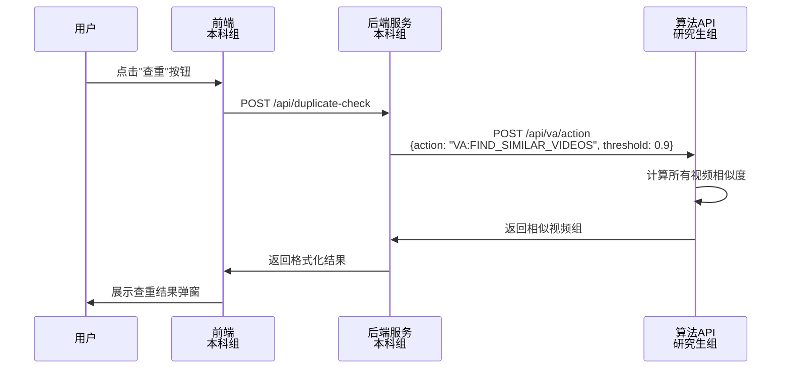
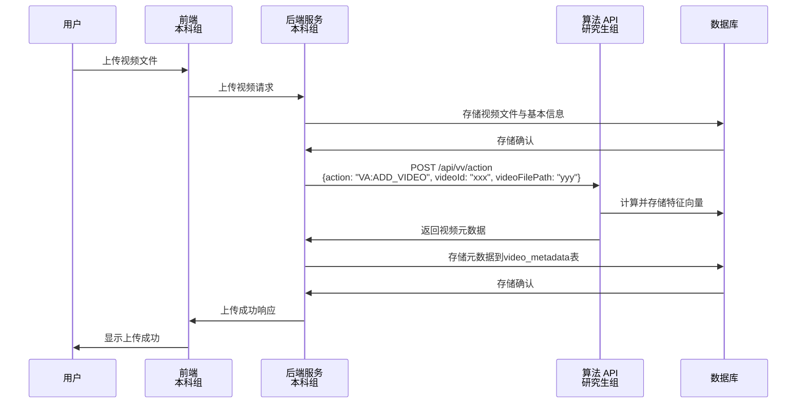
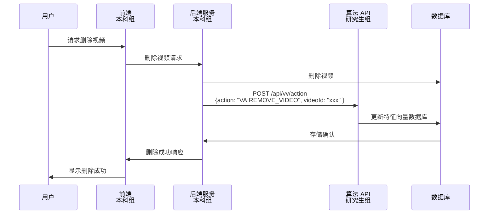

## 1.API 定义

### （1）请求执行相似视频查找

**REQUEST**
Endpoint: http://127.0.0.1:6590/api/va
Method: POST
Body:

```json
{
    "action": "VA:FIND_SIMILAR_VIDEOS",
    "threshold": 0.9
}
```

| 参数      | 说明                                                         |
| --------- | ------------------------------------------------------------ |
| action    | 指定任务类型                                                 |
| threshold | 相似度阈值，指定两个视频应达到什么样的相似度才会被视为“相似” |

**RESPONSE**

```json
{
    "success": true,
    "message": "",
    "data": [
        {
            "referenceVideo": "aow05202",
            "similarVideos": {
                "0x0fa9ax": 0.92,
                "ab90s9fa": 0.85,
                "aof09sa0": 0.95
            }
        },
        {
            "referenceVideo": "f2fafaow",
            "similarVideos": {
                "jfoeia9e": 0.85,
                "ojfs9909": 0.95
            }
        }
    ]
}
```

data 为一个数组，表示相似的视频组。

| 字段           | 类型        | 说明                                                                |
| -------------- | ----------- | ------------------------------------------------------------------- |
| referenceVideo | str         | 参考视频的 id                                                       |
| similarVideos  | {str:float} | 一个视频 id -> 相似度的字典，表示对应视频和 referenceVideo 的相似度 |

### （2）添加视频

**REQUEST**
Endpoint: http://127.0.0.1:6590/api/va
Method: POST
Body:

```json
{
    "action": "VA:ADD_VIDEO",
    "videoId": "f2fafaow",
    "videoFilePath": "/full/qualified/path/to/video/file.mp4"
}
```

| 参数          | 说明                   |
| ------------- | ---------------------- |
| action        | 指定任务类型           |
| videoId       | 视频 id                |
| videoFilePath | 视频文件的完整本地路径 |

**RESPONSE**

```json
{
    "success": true,
    "message": "",
    "data": {
        "width": 1920,
        "height": 1080,
        "fps": 30.0,
        "duration": 120,
        "fileType": "mp4",
        "fileSize": 10485760,
        "createTime": 1698765432,
        "modifyTime": 1698765432,
        "md5": "5d41402abc4b2a76b9719d911017c592"
    }
}
```

| 字段       | 类型   | 说明                                            |
| ---------- | ------ | ----------------------------------------------- |
| width      | int    | 视频画面宽度                                    |
| height     | int    | 视频画面高度                                    |
| fps        | float  | 视频帧率                                        |
| duration   | int    | 视频时长，单位秒                                |
| fileType   | string | 视频文件类型，确保全小写                        |
| fileSize   | int    | 视频文件大小，单位为字节                        |
| createTime | int    | 视频文件创建时间，unix 时间戳（秒单位，秒精度） |
| modifyTime | int    | 视频文件创建时间，unix 时间戳（秒单位，秒精度） |
| md5        | string | 视频文件的 md5，全小写                          |

### （3）删除视频

**REQUEST**
Endpoint: http://127.0.0.1:6590/api/va
Method: POST
Body:

```json
{
    "action": "VA:REMOVE_VIDEO",
    "videoId": "abc114514"
}
```

| 参数    | 说明         |
| ------- | ------------ |
| action  | 指定任务类型 |
| videoId | 视频 id      |

**RESPONSE**

```json
{
    "success": true,
    "message": ""
}
```

## 2.工作分配

### 本科组

**前端部分**
（1）在视频管理页面提供一个“查重”按钮，以调用查重功能
（2）提供呈现查重结果的界面（这一界面可以考虑通过在页面 Z 轴顶层创建一个模拟窗体 + 半透明黑色遮罩来实现，以避免对现有系统的 UI 进行修改）。该界面除了展示查重结果外，还需要提供“查看视频”与“删除视频”的功能。另外，由于返回的查重结果是按组分的，因此界面上尽量也在视觉上划分出“组”。

**后端部分**
（1）添加一个名为 video_metadata 的表，表结构如下

| 字段        | 类型                  |
| ----------- | --------------------- |
| id          | BIGINT AUTO_INCREMENT |
| video_id    | VARCHAR(36)           |
| width       | INT                   |
| height      | INT                   |
| fps         | FLOAT                 |
| duration    | INT                   |
| file_type   | VARCHAR(32)           |
| file_size   | BIGINT                |
| create_time | BIGINT                |
| modify_time | BIGINT                |
| md5         | CHAR(32)              |

（2）在视频上传完成后，添加对“添加视频”接口的调用，然后将接口的返回结果存到 video_metadata 表中。同样的，当删除视频后也添加对“删除视频”接口的调用。这两个接口务必后调用，因为要依赖 mysql 中的数据与视频文件。
（3）程序假定了 mysql 数据库 video_manage_system 的存在，请添加当数据库不存在时自动创建的行为。

注：前文所述的 API 的 endpoint 的 IP 地址与端口号仅做示例，实际请放在配置文件中

### 研究生组

（1）实现如下接口，完成视频特征向量的存储与相似度比较（核心工作）

```python
class IVideoAnalyzer:
    def add_video(self, video_id: str, video_file_path: str) -> None:
        # 工作示例，仅作示例
        # 1.提取关键帧
        # 2.计算关键帧特征向量并存储
        pass

    def get_similarity(self, video_id_a: str, video_id_b: str) -> float:
        # 工作示例，仅作示例
        # 利用向量库中存储的特征向量信息计算两个视频的相似度
        pass
```

（2）实现本文定义的 API

## 工作流图

**视频查重**



**视频上传**



**视频删除**


