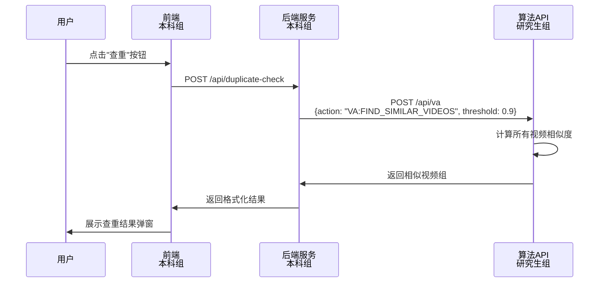

## 工作分配

### 本科组

**前端部分**
（1）在视频管理页面提供一个“查重”按钮，以调用查重功能
（2）提供呈现查重结果的界面（这一界面可以考虑通过在页面 Z 轴顶层创建一个模拟窗体 + 半透明黑色遮罩来实现，以避免对现有系统的 UI 进行修改）。该界面除了展示查重结果外，还需要提供“查看视频”与“删除视频”的功能。另外，由于返回的查重结果是按组分的，因此界面上尽量也在视觉上划分出“组”。

**后端部分**
（1）修改 videos 表，添加一个名为 file_path 的字段
（2）程序假定了 mysql 数据库 video_manage_system 的存在，请添加当数据库不存在时自动创建的行为。

注：前文所述的 API 的 endpoint 的 IP 地址与端口号仅做示例，实际请放在配置文件中

### 研究生组

（1）实现 [README.md](./README.md) 中定义的 API

## 工作流图

**视频查重**

```mermaid
sequenceDiagram
    participant User as 用户
    participant Frontend as 前端<br/>本科组
    participant Backend as 后端服务<br/>本科组
    participant Algorithm as 算法API<br/>研究生组

    User->>Frontend: 点击"查重"按钮
    Frontend->>Backend: POST /api/duplicate-check
    Backend->>Algorithm: POST /api/va<br/>{action: "VA:FIND_SIMILAR_VIDEOS", threshold: 0.9}

    Algorithm->>Algorithm: 计算所有视频相似度
    Algorithm->>Backend: 返回相似视频组
    Backend->>Frontend: 返回格式化结果
    Frontend->>User: 展示查重结果弹窗
```
