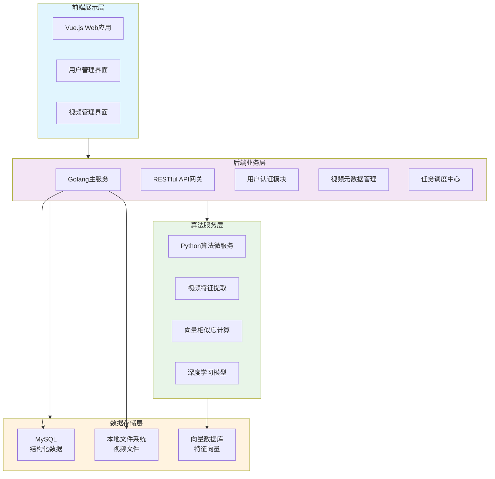

[TOC]

## 1.背景

电梯检验检测音视频是质量管理的重要一环，当前工作模式还缺乏有效的音视频文件重复检测的有效技术手段。项目拟在不改变现有工作业务流程的情况下研究：音视频文件特征重复；音视频文件特征自动监测；音视频文件特征重复辨识；个人音视频文件特征记录分析；风险分析等技术。关键技术：（1）基于音视频文件特征分析技术；（2）基于深度学习的视频文件特征提取技术。项目拟构建一个综合的音视频文件特征辨识系统。该系统能够自动检测音视频文件特征中的重复内容，从而为检验检测音视频的可靠性提供保障。研究成果将减少因音视频文件不准确而引发的质量管理问题，提升检验检测音视频的传输质量。

## 2.关键技术

本项目旨在实现对电梯监控视频的智能重复辨识，其核心由以下几个关键技术构成，这些技术之间共同协作，形成了一个从特征提取到高效检索比对的完整技术闭环。

### 2.1.视频内容特征提取
传统的基于文件哈希或元数据的比对方法，无法应对视频经过转码、裁剪或轻微编辑后的“视觉内容重复”问题。为解决这一挑战，本项目采用基于深度学习的视频内容特征提取技术。

该技术的核心在于利用图像到文本的多模态模型，这类模型能够深入理解图像的视觉语义，而非仅仅感知像素级的差异。具体流程如下：系统首先对上传的视频进行关键帧抽取，关键帧的抽取会基于帧间差异分析或按固定间隔采样，捕获视频中最具代表性和信息量的静态画面。随后，这些关键帧被送入多模态模型进行前向传播，模型最终会输出一个高维、稠密的特征向量。这个向量可以看作是该关键帧视觉内容的“数字指纹”，它将视频帧中所呈现的复杂视觉信息（如场景、物体、构图）编码为一组数值，称为特征向量。而具有相似的视觉内容的帧的特征向量在向量空间中的距离也会很近，因此可以通过比对特征向量的相似性来判断两帧的相似性，进而协助判断两个视频之间的相似性。

### 2.2.向量库
传统的关系型数据库难以高效处理高维特征向量的相似性搜索问题，为此，本项目将引入专用的向量数据库用于存储视频的特征向量，以辅助系统的相似性搜索工作。

向量数据库是专为存储、索引和快速检索高维向量数据而设计的数据库类型。在本系统中，所有由多模态模型生成的关键帧特征向量都被持久化存储于此。向量库具备高效存储、快速检索能力，能够对大规模特征向量数据进行有序管理，可为相似度匹配提供稳定的数据基础。

## 3.需求分析

为了确保系统的有效性与实用性，系统需满足以下核心需求，这些需求共同构成了系统设计与实现的功能基石。

### 3.3.提取视频文件基础特征
为实现对海量视频文件的初步管理与快速筛选，系统必须具备自动化提取视频文件基础元数据的能力。这些基础元数据是视频最表层的特征数据，其需求具体体现在

-   自动化提取：系统需能够自动、无需人工干预地读取视频文件的各类基础属性，涵盖文件创建日期、修改日期、文件大小、文件类型、帧速率、视频宽度、视频高度、总时长、文件哈希等关键信息。
-   双重作用：这些基础信息将发挥双重作用，一方面，它们会作为初步筛查的依据；另一方面，它们还会作为基于向量特征的重复检测的辅助判定条件，通过两者协同可以提升检测结果的准确性。

### 3.4.提取视频内容特征
为解决仅依靠基础特征无法识别“视觉内容相同但文件本身不同”的深层重复问题，系统必须深入到视频的视觉内容层面进行特征抽象。该需求的核心在于：

-   关键帧抓取：系统需采用特定算法（如内容变化率分析或均匀时间采样），从动态的视频流中智能地抓取能够代表其特征的静态画面，即“关键帧”。这旨在避免对每一帧进行处理，在保证代表性的同时显著降低计算开销，提高系统的响应速度。

-   特征向量化：抓取的关键帧图像需通过先进的深度学习模型进行处理，将其从像素空间转换到向量空间，生成一个能够反映其视觉内容的特征向量。

-   向量存储与管理：所有生成的特征向量需要被持久化地存储到专用的向量数据库中。该数据库必须具备高效存储和快速检索的能力，为后续大规模、高效率的相似性比对提供稳定、可扩展的数据基础。

### 3.5.重复检测
本系统的关键目标是实现对重复视频进行高效、精准地辨识，该需求具有明确的策略性和性能要求：

-   多模态融合检测：系统不能依赖单一特征，而必须采用综合研判策略，即同时融合视频的基础特征与深层的内容特征。通过构建一个综合的相似度计算模型，从大量视频中精准地检测出无论是文件完全一致，还是视觉要素完全相同的重复视频。

-   查全率优先原则：在检测策略上，必须遵循“允许误判但不允许漏判”的核心原则。这意味着系统在设计上应优先保证极高的查全率，确保尽可能不放过任何一个可能的重复视频，宁可将其标记为“疑似重复”交由人工复核，也绝不能将其漏掉可能重复的视频。在这一要求下，系统需要通过优化算法和调整阈值，将误判率维持在一个业务可接受的较低水准，以平衡检测精度与人工复核成本，最终实现高效可靠的重复检测目标。

## 4.实现方案

### 4.1.总体方案

（1）系统总体功能

-   用户权限管理：实现多级用户体系，支持管理员进行用户账号管理、部门配置和权限分配。

-   视频全生命周期管理：提供视频上传、存储、检索、查看和删除等完整管理功能。

-   智能重复检测：基于多模态特征提取和向量相似度匹配，自动识别内容重复的视频文件。

（2）系统总体框架

### 4.2.基础特征提取方案

视频基础信息可通过如下表格示例的方式获取

| 属性     | 方法                       |
| -------- | -------------------------- |
| 创建日期 | 读取文件元数据             |
| 修改日期 | 读取文件元数据             |
| 文件大小 | 读取文件元数据             |
| 类型     | 读取文件扩展名与文件头信息 |
| 帧速率   | 使用 exiftool              |
| 宽度     | 使用 exiftool              |
| 高度     | 使用 exiftool              |
| 时长     | 使用 exiftool              |

### 4.3.内容特征提取方案

// TODO

### 4.4.软件界面

登录界面

用户管理界面

视频管理界面

### 4.5.系统实现

本系统的实现遵循现代软件工程的最佳实践，采用分层与模块化设计，以确保系统的可维护性、可扩展性以及高性能。具体实现方案如下

（1）系统架构设计
系统采用经典的 B/S 架构，所有业务逻辑与数据存储均集中在服务器端，用户只需通过标准的网页浏览器即可访问全部功能，无需安装任何客户端软件。这种架构在极大地降低了部署、升级和维护的成本的同时有效提高了系统的模块化能力与可迁移性。在整体架构上，系统清晰地划分为表现层、应用层、数据层，实现了前后端职责分离，通过定义良好的 API 接口进行通信，保证了各层之间的独立性与可替换性。

（2）前端实现
本系统的前端部分采用 Vue.js 框架进行构建。Vue.js 以其轻量、高效和渐进式的特点，能够构建出复杂的单页面应用。

（3）后端实现
本系统的后端采用了多语言协同架构，根据不同的任务选择最合适的编程语言，以实现性能与开发效率的最佳平衡。

-   Golang 服务模块：负责基础业务与数据交互，包括用户认证与授权、用户与部门数据管理、视频的上传等 CRUD 操作。Golang 以其卓越的并发性能、高效的编译执行速度以及简洁的语法，非常适合构建高并发、高性能的数据处理服务。后端代码按功能模块进行组织，严格遵循控制器-服务-数据访问对象的分层模式。这确保了业务逻辑、数据持久化逻辑和 Web 请求处理逻辑的解耦，提高了代码的可测试性和可维护性。

-   Python 服务模块：负责计算密集型的核心业务，即视频的特征提取与重复性判断则采用 Python 语言进行开发。Python 凭借其在人工智能、科学计算和数据处理领域庞大而成熟的生态系统（如 TensorFlow、PyTorch、OpenCV、NumPy、Pandas 等），能够高效、便捷地实现复杂的深度学习模型推理和图像处理算法。该模块的核心任务在于将 Golang 服务传送来的进行特征提取，生成高维特征向量，并执行高效的相似度匹配与重复判定逻辑。

（4）数据存储方案
系统采用混合存储策略，针对不同的数据选择最合适的存储方式，以平衡性能、成本与复杂性

-   结构化数据存储：对于需要高度结构化存储和复杂查询的数据，例如用户账户、部门信息与视频元数据，系统采用关系型数据库 MySQL 进行存储。MySQL 的 ACID 特性和强大的 SQL 查询能力，能够可靠地保障这些核心业务数据的一致性与完整性。

-   非结构化数据存储：对于体积庞大，没有结构化特征的视频文件本身，系统采用本地文件系统直接管理的策略。这种方案避免了将大文件存入数据库所带来的性能瓶颈和存储成本激增问题。系统会在服务器本地创建规范的目录结构，并通过数据库中的元数据记录文件的存储路径，从而实现高效的存储、访问与备份管理。

-   向量数据存储：对于由 Python 算法服务生成的高维视频特征向量，系统采用专用的向量数据库进行存储。这类数据库（如 Milvus、Chroma 等）专为高效处理向量相似性搜索而设计，其核心能力在于构建先进的索引算法（如 HNSW、IVF），能够在大规模向量集中实现毫秒级的近似最近邻搜索。这与传统关系型数据库的处理模式截然不同，完美契合了本系统通过内容特征进行重复检测的核心需求。

## 5.项目总结

本系统构建了一个功能完善的视频管理平台，实现了从视频上传、存储管理到重复性分析的全流程闭环。系统通过采用 B/S 架构，结合 Vue.js 前端框架与 Golang+Python 的后端混合技术栈，在保证系统性能的同时，充分发挥了不同编程语言的技术优势。

核心成果体现在以下两个方面：

-   智能化视频内容管理：系统不仅支持用户便捷地上传、检索和查看视频，更重要的是实现了基于深度学习的智能重复检测功能。通过视频的元数据特征与视觉内容特征协同比对，显著提升了重复视频识别的准确率。

-   精细化的权限管理：建立了完整的用户管理体系，支持基于部门的权限划分和角色控制，确保了业务数据的安全性和操作流程的规范性，满足了企业级应用的安全管理需求。

本系统能极大地降低了检验人员从海量视频中人工筛选重复数据的难度与时间成本，有效提升了视频管理工作的效率与数字化水平。
